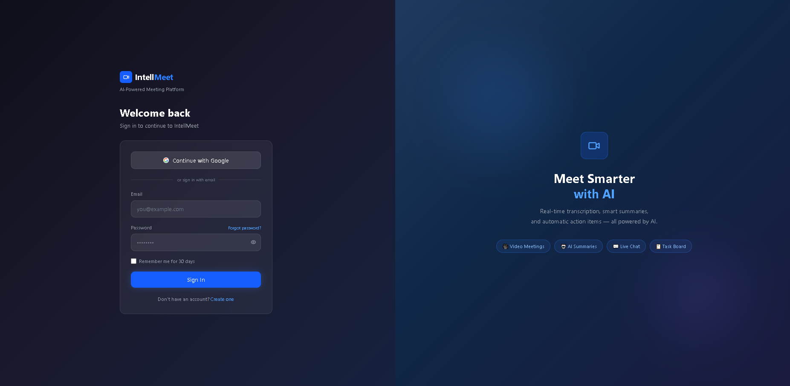
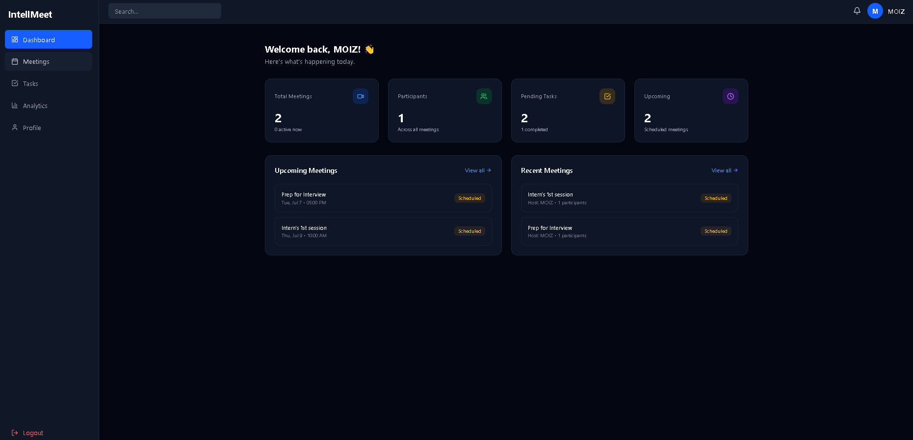
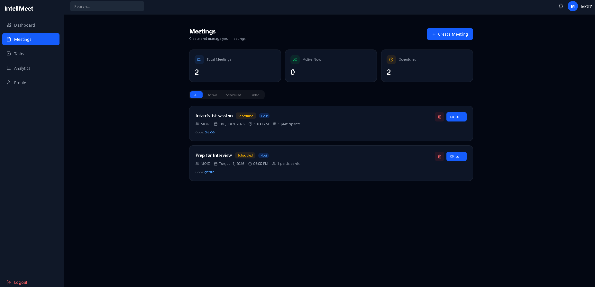
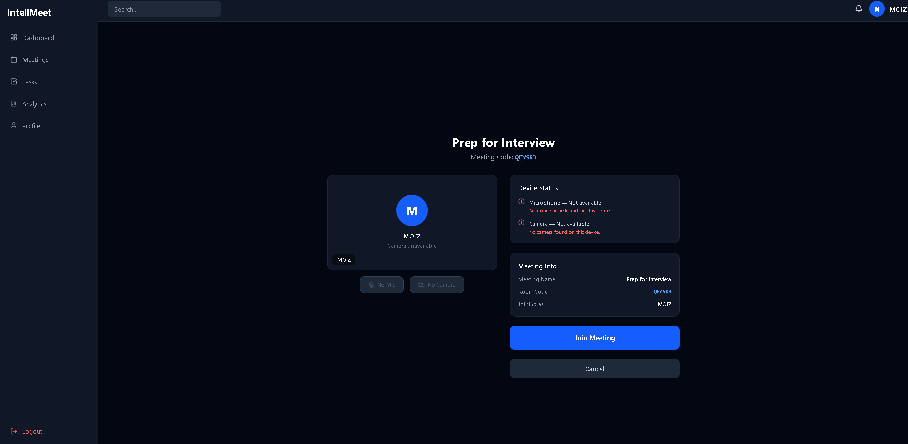
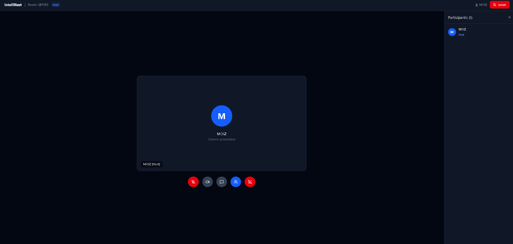
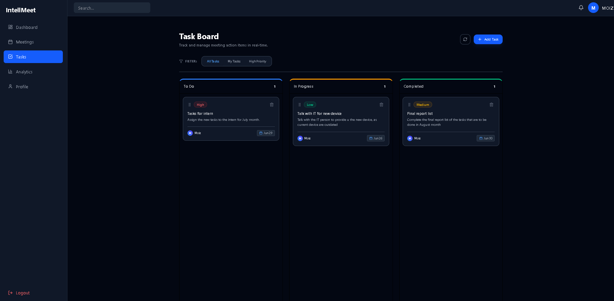
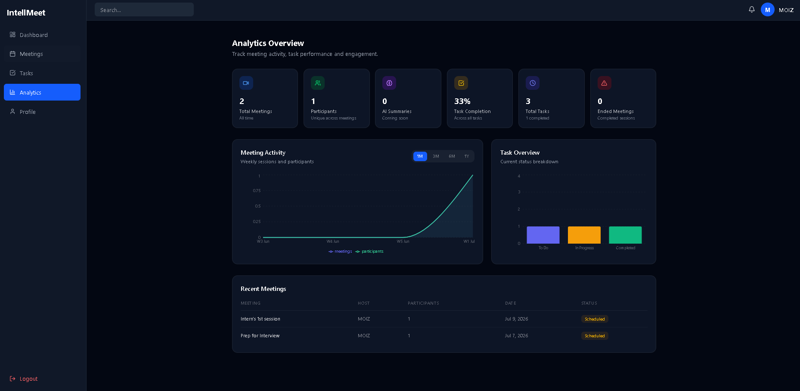
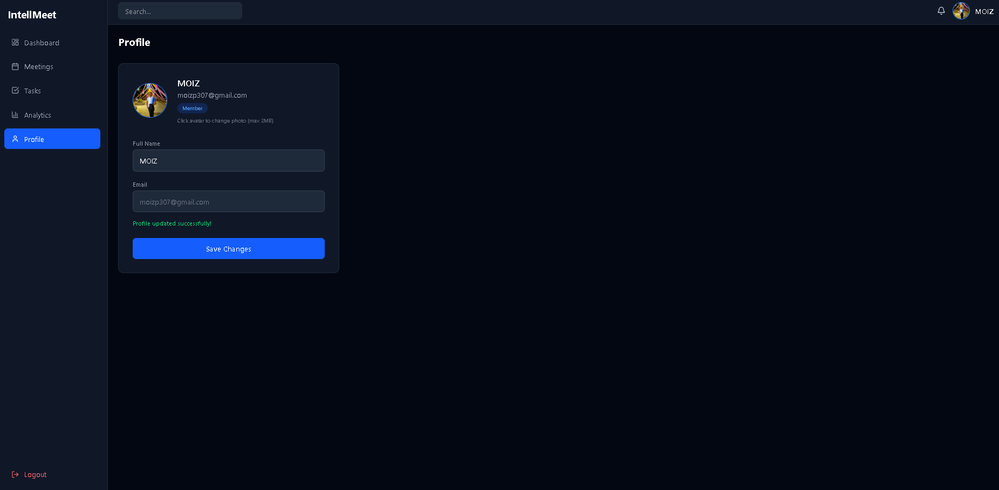

# IntellMeet 🎯
### AI-Powered Enterprise Meeting & Collaboration Platform

> Built as part of the **Zidio Development Internship 2026** — Web Development (MERN) Domain

IntellMeet is a meeting and collaboration platform built with the MERN stack. It brings together real-time video conferencing, meeting scheduling, team chat, Kanban task management, and a productivity analytics dashboard — all in one place, behind a redesigned enterprise-SaaS interface.

> 📸 **Note:** The screenshots below are from the previous UI. The frontend has since been redesigned (dark glassmorphism theme, new landing page, new component library) — see [Design & Redesign](#-design--redesign) below. Screenshots will be refreshed in a future update.











---

## 🚀 Live Demo
> https://zidio-intellmeet.vercel.app/

For deploying this project yourself, see **[DEPLOYMENT.md](./DEPLOYMENT.md)** — the frontend goes on Vercel, the backend needs a host that supports persistent connections (Railway, Render, Fly.io, or a VPS) since it uses Socket.io.

---

## ⚙️ Tech Stack


**Frontend:** React 19 + TypeScript · Vite · Tailwind CSS v4 · Zustand · React Router v6 · Framer Motion · Lucide Icons

**Backend:** Node.js + Express · MongoDB + Mongoose · Socket.io · JWT Authentication

**DevOps:** Docker + Docker Compose · GitHub Actions CI/CD · Render/Railway (Backend) · Vercel (Frontend)

---

## 🎨 Design & Redesign

The frontend UI was fully redesigned into a dark, glassmorphic enterprise-SaaS
aesthetic without touching any backend logic, API contracts, or routing behavior:

- **Theme:** dark-mode-first, glassmorphism, gradient accents (`#6366F1` → `#8B5CF6` → `#06B6D4`), Plus Jakarta Sans / Inter typography
- **New shared UI kit** (`client/src/components/ui/`): Button, Input, Card, Badge, Modal, EmptyState, Skeleton — used across every page for visual consistency
- **New pages:** a marketing Landing Page (`/`) and a Forgot Password flow (`/forgot-password`), neither of which existed before
- **Animated with Framer Motion:** page transitions, hover/active states, sidebar active-indicator, modals, panels
- **Dashboard AI Summary widget:** a heuristic summary computed client-side from your real meetings/tasks data (not an LLM call — flagged honestly in-app as "Beta")
- All WebRTC/socket/auth/CRUD logic in `MeetingRoom`, `PreJoin`, `MeetingPage`, `KanbanPage`, dashboards, etc. is untouched — only markup/styling changed

---

## ✨ Features

- [x] Authentication — JWT + Refresh Tokens + Role Based Access Control
- [x] Protected & Public Routes
- [x] Landing Page — marketing page with feature highlights, testimonials, CTA
- [x] Forgot Password flow (UI ready; backend endpoint not yet implemented — see note in `client/src/pages/auth/ForgotPasswordPage.tsx`)
- [x] App Shell Layout — Sidebar (collapsible) + Navbar + mobile drawer across all pages
- [x] Dashboard — Live stats, AI-style summary widget, upcoming meetings, recent meetings
- [x] Meetings — Create, join, delete, filter, auto status updates
- [x] Pre-Join Preview — Camera/mic check before entering meeting room
- [x] Meeting Room — Local media preview, mic/camera toggle, real-time chat, participants list
- [x] Kanban Task Board — Drag & drop, real-time DB (with local-storage offline fallback), filters (All / My Tasks / High Priority)
- [x] Analytics — Live meeting + task charts, recent meetings table
- [x] User Profile — Tabbed settings: General (name/avatar), Notifications, Security, Appearance (accent color)
- [x] User Roles — admin / host / member / viewer
- [x] Fully Responsive UI (desktop, laptop, tablet, mobile)
- [ ] Peer-to-peer video between participants (current `MeetingRoom` shows local camera preview + real-time chat/participants over Socket.io; there is no `RTCPeerConnection`/TURN-STUN signaling wired up yet)
- [ ] Screen Sharing & Recording
- [ ] AI Meeting Transcription (Whisper)
- [ ] AI Summaries & Action Item Extraction (GPT-4) — dashboard currently ships a heuristic, non-LLM summary widget as a placeholder for this

---

## 👥 Team

| Name | Role | GitHub |
|------|------|--------|
| Moiz | Team Lead + Auth + Meetings + Integration + DevOps | [@patel-moiz-371](https://github.com/patel-moiz-371) |
| Jay | Frontend + Dashboard + UI Components | [@gaikwadjay181](https://github.com/gaikwadjay181) |
| Rohit | Meetings + Chat + Socket.io *(incomplete)* | [@DhoriRohit1](https://github.com/DhoriRohit1) |
| Charulatha | Kanban + Task Management | [@Charulatha2324](https://github.com/Charulatha2324) |

---

## 📁 Branch Strategy

| Branch | Purpose |
|--------|---------|
| `main` | Production ready — final release only |
| `develop` | Active development — all work happens here |

> ⚠️ All active development is on the `develop` branch. `main` will only be updated upon final release.

---

## 🗂️ Project Structure
```
intellmeet/
├── client/                  # React 19 + Vite frontend
│   └── src/
│       ├── components/
│       │   ├── ui/          # Shared design-system primitives (Button, Card, Modal, Badge, Input, Skeleton, EmptyState)
│       │   ├── layout/      # AppShell, Navbar, Sidebar (+ mobile drawer)
│       │   ├── analytics/   # StatsCard
│       │   ├── meeting/     # MeetingCard
│       │   └── kanban/      # Board, Column, TaskCard, AddTaskModal
│       ├── pages/
│       │   ├── landing/     # Marketing Landing Page
│       │   ├── auth/        # Login, Register, ForgotPassword, AuthCallback
│       │   ├── dashboard/   # Dashboard
│       │   ├── meeting/     # MeetingPage, MeetingRoom, PreJoin
│       │   ├── tasks/       # Kanban Board
│       │   ├── analytics/   # Analytics
│       │   └── profile/     # User Profile (tabbed settings)
│       ├── store/           # Zustand state (auth)
│       └── router/          # App routing (AppRouter)
├── server/                  # Node.js + Express backend
│   └── src/
│       ├── modules/
│       │   ├── auth/        # Register, Login, Refresh, Logout
│       │   ├── meetings/    # Meeting CRUD + join + status
│       │   ├── tasks/       # Task CRUD + status update
│       │   └── users/       # Profile get + update
│       ├── middleware/      # Auth, error handler
│       ├── socket/          # Socket.io — chat + participants
│       └── utils/           # ApiResponse, ApiError, asyncHandler
├── docs/                    # Screenshots & documentation
├── DEPLOYMENT.md            # Step-by-step deploy guide (Vercel + Railway/Render)
└── .github/                 # CI/CD workflows
```
---

## 🛠️ Local Setup

### Prerequisites
- Node.js v20+
- Git
- MongoDB Atlas account (free)

### 1. Clone the Repository
```bash
git clone https://github.com/patel-moiz-371/intellmeet-intership-project.git
cd intellmeet-intership-project
git checkout develop
```

### 2. Setup the Server
```bash
cd server
npm install
cp .env.example .env   # then fill in your own values
npm run dev
```

See `server/.env.example` for the full list of variables (`MONGO_URI`,
`JWT_SECRET`, `JWT_REFRESH_SECRET`, `CLIENT_URL`, optional Google OAuth vars).

### 3. Setup the Client
```bash
cd client
npm install
cp .env.example .env   # then point VITE_API_URL / VITE_SOCKET_URL at your server
npm run dev
```

### 4. Open in Browser
Frontend: http://localhost:3000
Backend:  http://localhost:5000/health

### Deploying to production
See **[DEPLOYMENT.md](./DEPLOYMENT.md)** for the full Vercel + Railway/Render walkthrough.

---

## 🔐 API Endpoints

### Auth
| Method | Endpoint | Description |
|--------|----------|-------------|
| POST | `/api/auth/register` | Register new user |
| POST | `/api/auth/login` | Login user |
| POST | `/api/auth/refresh` | Refresh access token |
| POST | `/api/auth/logout` | Logout user |

### Users
| Method | Endpoint | Description |
|--------|----------|-------------|
| GET | `/api/users/me` | Get current user profile |
| PATCH | `/api/users/me` | Update name + avatar |

### Meetings
| Method | Endpoint | Description |
|--------|----------|-------------|
| GET | `/api/meetings` | Get all meetings |
| POST | `/api/meetings` | Create new meeting |
| GET | `/api/meetings/:meetingId` | Get meeting by ID |
| PATCH | `/api/meetings/:meetingId/status` | Update meeting status |
| PATCH | `/api/meetings/:meetingId/join` | Join a meeting |
| DELETE | `/api/meetings/:meetingId` | Delete a meeting |

### Tasks
| Method | Endpoint | Description |
|--------|----------|-------------|
| GET | `/api/tasks` | Get all tasks |
| POST | `/api/tasks` | Create new task |
| PATCH | `/api/tasks/:taskId/status` | Update task status |
| DELETE | `/api/tasks/:taskId` | Delete task |
| GET | `/api/tasks/meeting/:meetingId` | Get tasks by meeting |

> Not yet implemented on the backend (frontend has UI ready for these):
> `POST /api/auth/forgot-password`, `PATCH /api/auth/change-password`

---

## 🤝 Team Workflow

```bash
# Start your work session
git checkout develop
git pull origin develop

# Create your feature branch
git checkout -b feature/your-feature-name

# After completing work
git add .
git commit -m "feat: describe your change"
git push origin feature/your-feature-name

# Then open a Pull Request into develop
```

---

*© 2026 IntellMeet — Zidio Development Internship Project*
